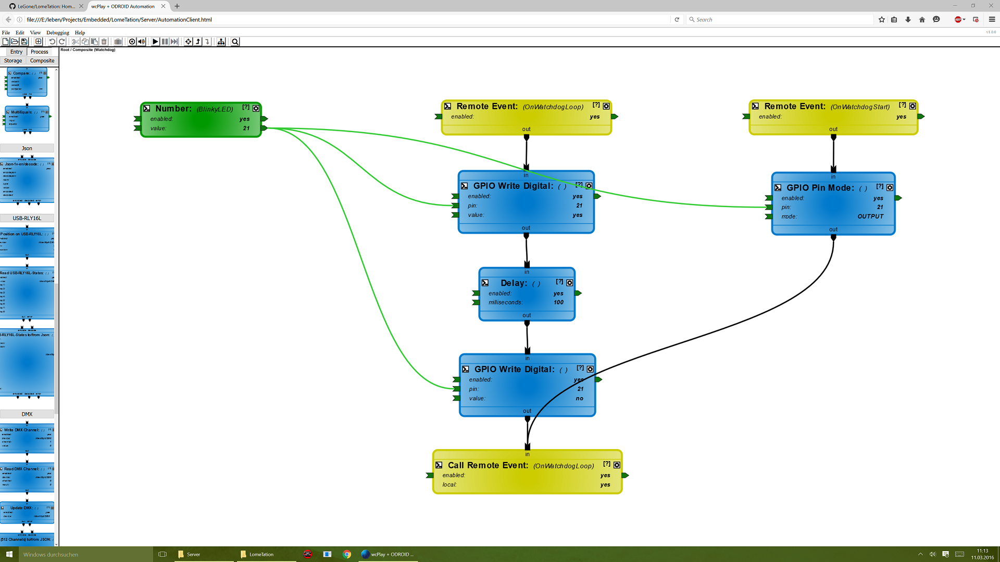

# LomeTation
LomeTation is a homeautomation system using NodeJs and wcPlay.
It´s purpose is to run any "linux embedded computer" like Raspberry PI, Odroid C1, ... that supports(and runs) NodeJs.

Design your own homeautomation-logic graphically and let your embedded-system run it!

# How can I use it?
1. Install NodeJs (on your server)

2. Install dependencies
npm install

3. Use wcPlay to design your personal homeautomation-script.

4. Copy the files to your embedded computer

5. Run the script - # nodejs NodeJsServer.js script.wcplay

# What is supported?
Hardware
 * USB-RLY16L - Bistable Relais
 * USB-To-DMX512-Devices
 * GPIO
 * LCD-Display (Only tested the ODROID C1-Display so far!)
 * OneWire
 * ...
 
Software - Protocols, ...
 * Write/receive data to/from the network using TCP/websockets/JSON
 * DMX-Protocol
 * Display text on the onboard lcd-display (Odroid C1)
 * OneWire
 * ...
 
JSON-Service (and websockets)
 * Write JSON to the server to change something (e.g. turn the led-light to blue).
 * Receive Data from the server (e.g. what color has the led-light?)
 * Everything in JSON